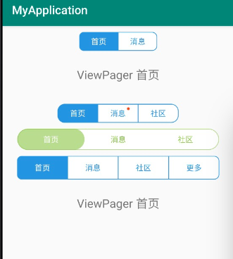

- [简介](#简介)
- [引入方式](#引入方式)
- [使用](#使用)
- [方法介绍](#方法介绍)
- [效果图](#效果图)

### 简介
Android TabLayout库,目前有3个TabLayout,
 * QFCommonTabLayout
   * 不支持滑动的，对ViewPager依赖不强的TabLayout
   * 支持自定义Indicator样式
   * 支持Indicator跟随文字长度变化
   * 支持未读消息显示
   * 支持tab间分割线的设置
   * 支持选中和未选中的icon设置和字体颜色，字体大小设置
   * 支持显示纯文字
   * 支持在中间设置单独按钮
   * 支持选中Tab之后，Tab上覆盖图片
   * 支持选中tab的（无覆盖图片及设置单独按钮情况下）快速双击操作
 * QFSlidingTabLayout
   * 支持滑动的，对ViewPager依赖强的TabLayout
   * 支持自定义Indicator样式
   * 支持Indicator跟随文字长度变化
   * 支持未读消息显示
   * 支持选中和未选中的字体颜色设置
 * QFSegmentTabLayout
   * 支持自定义边框颜色，宽度的设置
   * 支持选中和未选中的填充色设置
   * 支持选中和未选中的字体颜色设置
   * 支持tab间分割线的设置
   * 支持自定义Indicator样式
   * 支持未读消息显示
### 引入方式

   ```
    allprojects {
		repositories {
			...
			maven { url 'https://jitpack.io' }
		}
	}
	
	dependencies {
	        implementation 'com.github.wangshouxue:SXTabLayout:Tag'
	}
   ```

### 使用
 - QFCommonTabLayout使用
   ```
   <com.qianfanyun.qfui.tablelayout.QFCommonTabLayout
        android:id="@+id/tl_2"
        android:layout_width="match_parent"
        android:layout_height="wrap_content"
        android:layout_alignParentBottom="true"
        android:paddingBottom="8dp"
        android:paddingTop="8dp"
        android:background="#DDDDDD"
        tl:tl_textsize="16sp"
        tl:tl_indicator_color="#2C97DE"
        tl:tl_textSelectColor="#2C97DE"
        tl:tl_textUnselectColor="#66000000"/>
   QFCommonTabLayout mTabLayout_2 = findViewById(R.id.tl_2);
   mTabLayout_2.setTabData(tabEntities);
   ```
 - QFSlidingTabLayout使用
   ```
   <com.qianfanyun.qfui.tablelayout.QFSlidingTabLayout
        android:id="@+id/sliding_tl_1"
        android:layout_width="match_parent"
        android:layout_height="wrap_content"
        android:background="#ffffff"
        android:paddingBottom="8dp"
        android:paddingTop="8dp"
        tl:tl_indicator_width_equal_title="true"
        tl:tl_indicator_color="#42B647"
        tl:tl_underline_height="0dp"
        tl:tl_textSelectColor="#42B647"
        tl:tl_textUnselectColor="#333333"/>
    QFSlidingTabLayout mTabLayout_1=findViewById(R.id.sliding_tl_1);
    ViewPager mViewPager=findViewById(R.id.vp);
    MyPagerAdapter pagerAdapter=new MyPagerAdapter(getSupportFragmentManager());
    pagerAdapter.setData(mFragments);
    pagerAdapter.setmTitles(mTitles);
    mViewPager.setAdapter(pagerAdapter);
    mTabLayout_1.setViewPager(mViewPager);
    ```
 - QFSegmentTabLayout使用
   ```
   <com.qianfanyun.qfui.tablelayout.QFSegmentTabLayout
        android:id="@+id/segment_tl"
        android:layout_width="wrap_content"
        android:layout_height="32dp"
        android:layout_gravity="center_horizontal"
        android:layout_marginTop="10dp"
        tl:tl_bar_color="#ffffff"
        tl:tl_indicator_color="#2C97DE"
        tl:tl_indicator_corner_radius="8dp"
        tl:tl_tab_padding="20dp"/>

   QFSegmentTabLayout tabLayout=findViewById(R.id.segment_tl);
        tabLayout.setTabData(mTitles_1);
   ```
### 方法介绍
- QFCommonTabLayout布局中支持设置的属性如下：
 
   | 方法名                    | 作用                   | 备注        |
   | :------------------------| -----------------------|------------|
   | tl_publishMode           | 有COVER（选中覆盖图片）,CENTER（中间设置单独按钮）两个可选值| 
   | tl_centerPublishIcon     | 设置单独按钮的图片      |
   | tl_indicator_color       | 设置指示器的颜色        |
   | tl_indicator_height      | 设置指示器的高          |
   | tl_indicator_width       | 设置指示器的宽          |
   | tl_indicator_margin_left      | 设置指示器的距左的距离          |
   | tl_indicator_margin_top       | 设置指示器的距顶的距离          |
   | tl_indicator_margin_right     | 设置指示器的距右的距离         |
   | tl_indicator_margin_bottom    | 设置指示器的距底的距离          |
   | tl_indicator_corner_radius    | 设置指示器的圆角               |
   | tl_indicator_gravity          | 设置指示器的位置               |
   | tl_underline_color            | 设置分割线的颜色              |
   | tl_underline_height           | 设置分割线的高度             |
   | tl_underline_gravity          | 设置分割线的位置               |
   | tl_divider_color              | 设置tab间分割线的颜色           |
   | tl_divider_width              | 设置tab间分割线的宽            |
   | tl_divider_padding            | 设置tab间分割线的padding        |
   | tl_tab_padding                | 设置tab内部间距           |
   | tl_tab_width                  | 设置tab的宽        |
   | tl_textsize                   | 设置文字的大小（未选中）               |
   | tl_textSelectSize             | 设置选中文字的大小（默认同未选中一样）           |
   | tl_textSelectColor            | 设置选中文字的颜色           |
   | tl_textUnselectColor          | 设置未选中文字的颜色        |
   | tl_textBold                   | 设置文字是否加粗          |0不加粗,1选中时加粗,2都加粗
   | tl_textAllCaps                | 设置文字转大写       |只针对英文有效
   | tl_iconWidth                | 设置icon宽度       |
   | tl_iconHeight                | 设置icon高度       |
   | tl_iconVisible                | 设置icon是否可见       |
   | tl_iconGravity                | 设置icon显示位置 ,对应Gravity中常量值  |
   | tl_iconMargin                | 设置icon与文字间距       |

- SlidingTabLayout布局中支持设置的属性如下：
  
   | 方法名                    | 作用                   | 备注        |
   | :------------------------| --------------------- | --------- |
   | tl_indicator_color       | 设置指示器的颜色        |
   | tl_indicator_height      | 设置指示器的高          |
   | tl_indicator_width       | 设置指示器的宽          |
   | tl_indicator_margin_left      | 设置指示器的距左的距离          |
   | tl_indicator_margin_top       | 设置指示器的距顶的距离          |
   | tl_indicator_margin_right     | 设置指示器的距右的距离         |
   | tl_indicator_margin_bottom    | 设置指示器的距底的距离          |
   | tl_indicator_corner_radius    | 设置指示器的圆角               |
   | tl_indicator_gravity          | 设置指示器的位置               |
   | tl_indicator_width_equal_title| 设置指示器长度随文字内容而定
   | tl_underline_color            | 设置分割线的颜色              |
   | tl_underline_height           | 设置分割线的高度             |
   | tl_underline_gravity          | 设置分割线的位置               |
   | tl_divider_color              | 设置tab间分割线的颜色           |
   | tl_divider_width              | 设置tab间分割线的宽            |
   | tl_divider_padding            | 设置tab间分割线的padding        |
   | tl_tab_padding                | 设置tab内部间距           |
   | tl_tab_width                  | 设置tab的宽        |
   | tl_textsize                   | 设置文字的大小（未选中）               |
   | tl_textSelectColor            | 设置选中文字的颜色           |
   | tl_textUnselectColor          | 设置未选中文字的颜色        |
   | tl_textBold                   | 设置文字是否加粗          |0不加粗,1选中时加粗,2都加粗
   | tl_textAllCaps                | 设置文字转大写       |只针对英文有效
   
- SegmentTabLayout布局中支持设置的属性如下：
  
   | 方法名                    | 作用                   | 备注        |
   | :------------------------| --------------------- | --------- |
   | tl_indicator_color       | 设置指示器的颜色        |
   | tl_indicator_height      | 设置指示器的高          |
   | tl_indicator_margin_left      | 设置指示器的距左的距离          |
   | tl_indicator_margin_top       | 设置指示器的距顶的距离          |
   | tl_indicator_margin_right     | 设置指示器的距右的距离         |
   | tl_indicator_margin_bottom    | 设置指示器的距底的距离          |
   | tl_indicator_corner_radius    | 设置指示器的圆角               |
   | tl_divider_color              | 设置tab间分割线的颜色           |
   | tl_divider_width              | 设置tab间分割线的宽            |
   | tl_divider_padding            | 设置tab间分割线的padding        |
   | tl_tab_padding                | 设置tab内部间距           |
   | tl_tab_width                  | 设置tab的宽        |
   | tl_textsize                   | 设置文字的大小（未选中）               |
   | tl_textSelectColor            | 设置选中文字的颜色           |
   | tl_textUnselectColor          | 设置未选中文字的颜色        |
   | tl_textBold                   | 设置文字是否加粗          |0不加粗,1选中时加粗,2都加粗
   | tl_textAllCaps                | 设置文字转大写       |只针对英文有效
   | tl_bar_color                  | 设置未选中tab填充色           |
   | tl_bar_stroke_color           | 设置边框色           |
   | tl_bar_stroke_width           | 设置边框宽           |

### 效果图
   
   
   